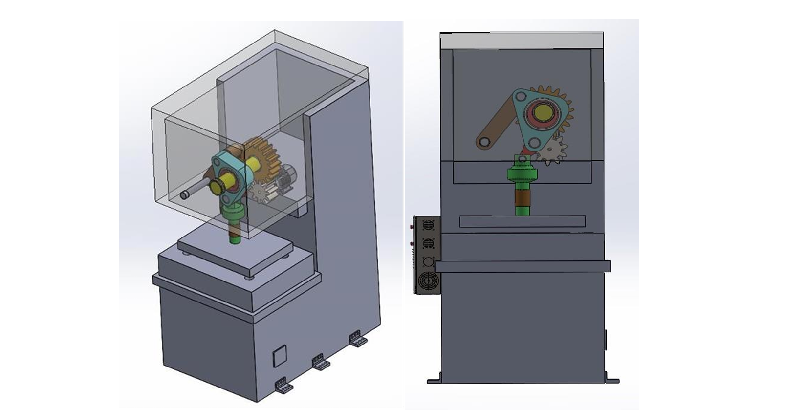
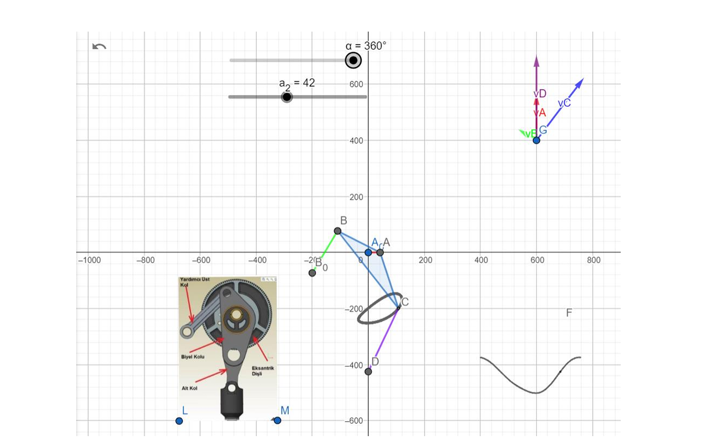
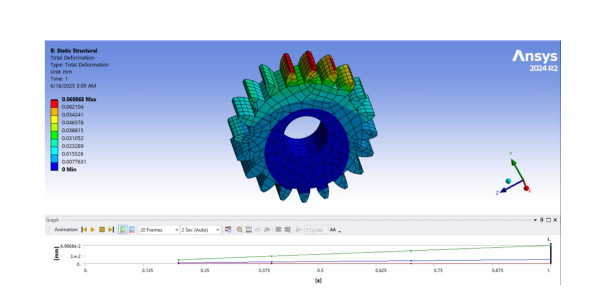
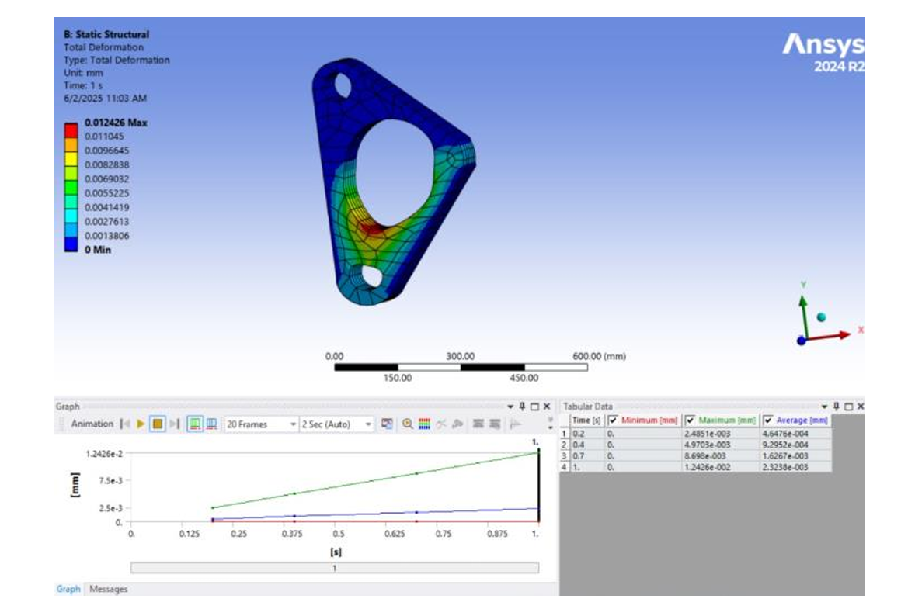

# 300-Ton Link Drive Mechanical Press

> Design and Engineering Analysis of a 300-Ton Link Drive Mechanical Press for Automotive Sheet Metal Forming.

---

## 📖 Project Overview

This repository presents a graduation capstone project completed at Isik University.
The project focuses on the complete design and engineering analysis of a **300-Ton Link Drive Mechanical Press** intended for automotive manufacturing applications.

The objective was to develop a high-performance mechanical press capable of:

- Delivering a maximum pressing force of **300 tons (3000 kN)**
- Producing a **130 mm stroke**
- Operating at **15 strokes per minute**
- Optimizing the slide motion using a **Link Drive Mechanism**
- Ensuring structural safety through engineering calculations and finite element analysis (FEA)

- ---

## 🛠 Software Used

- SolidWorks
- ANSYS Mechanical
- MATLAB
- Microsoft Excel

- ---

## ⚙ Engineering Scope

This project includes:

- Mechanical System Design
- Link Drive Mechanism Design
- CAD Modeling
- Kinematic Analysis
- Finite Element Analysis (FEA)
- Stress Analysis
- Deformation Analysis
- Fatigue Analysis
- Modal Analysis
- Material Selection
- Motor Selection
- Engineering Drawings

- ---

## 📊 Key Engineering Specifications

| Parameter | Value |
|-----------|-------|
| Press Capacity | 300 Tons (3000 kN) |
| Stroke Length | 130 mm |
| Stroke Rate | 15 strokes/min |
| Mechanism | Link Drive |
| CAD Software | SolidWorks |
| Engineering Analysis | ANSYS Mechanical |
| Kinematic Analysis | MATLAB |

---

## 👨‍💻 Team & My Contribution

This project was completed as a graduation capstone project by a team of four engineering students at **Isik University**.

### My Contributions

• Mechanical design and CAD modeling of selected machine components
• MATLAB-based kinematic analysis of the link-drive mechanism
• Engineering calculations and component sizing
• Material selection
• Technical documentation and report preparation

---

---

# 📷 Project Gallery

## Complete Assembly

---

## MATLAB Kinematic Analysis

---

## ANSYS Gear Stress Analysis

---

## Connecting Rod Plate Stress

## 📄 Documentation

The complete graduation thesis is available in this repository:

📄 **Report.pdf**
